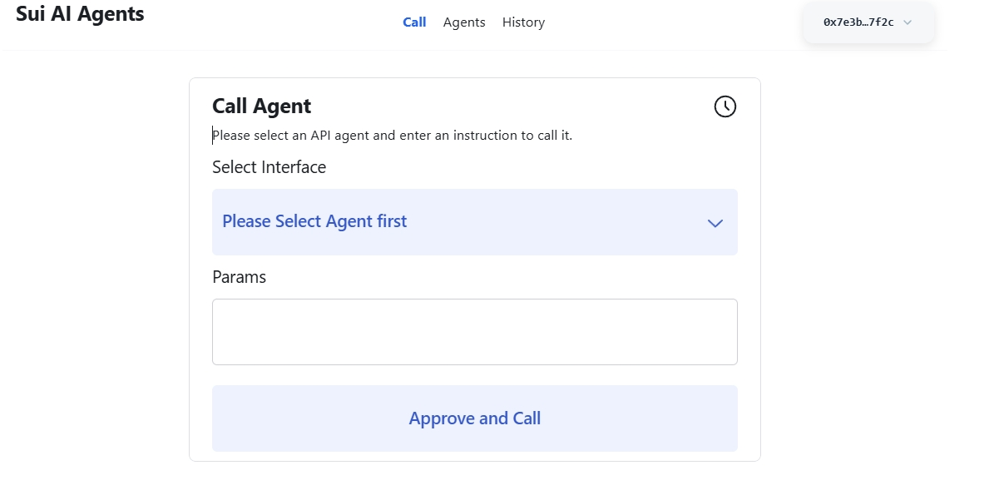
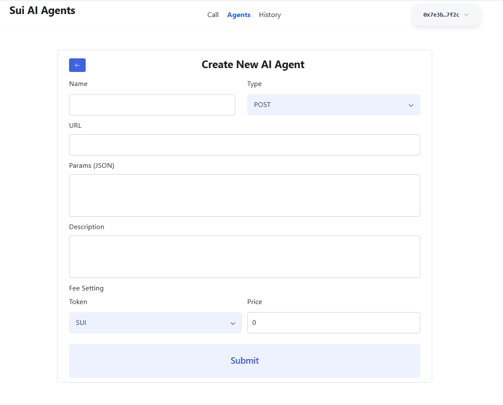

# Sui AI Agents

**Sui-AI-Agents** is a cutting-edge decentralized AI agent network that merges AI with web3 technology, creating a permissionless network for AI agents. The platform pioneers an Artificial Intelligence finance system (AiFi), enhancing transparency, security, and efficiency in deploying, operating, and transacting AI services via blockchain.

## 🌟 Key Features

- **Decentralized AI Agent Network**: Create and manage AI agents on the Sui blockchain
- **Web3 Integration**: Seamless integration with Sui blockchain for payments and storage
- **Walrus Storage**: Fully decentralized storage for agent results using Walrus
- **Multi-Token Support**: Supports SUI and BUCK tokens for payments
- **Agent Marketplace**: Discover and interact with AI agents created by the community
- **Real-time Event Processing**: Automatic indexing and processing of blockchain events
- **Encrypted API Endpoints**: Secure storage of agent API configurations

## 🏗️ Architecture

The platform consists of three main components:

1. **Smart Contracts (Move)**: Core blockchain logic for agent management and payments
2. **Backend Server (Node.js)**: Event indexing, API management, and data processing
3. **Frontend Application (React)**: User interface for interacting with agents


## 📸 Screenshots

### Call Page


### Agents Create Page



## 🚀 Getting Started

### Prerequisites

Before you begin, ensure you have the following installed:

- **Node.js** (v18 or higher)
- **npm** or **yarn**
- **Sui CLI** (for contract deployment)
- **Git**

### 📦 Installation

1. **Clone the repository**
   ```bash
   git clone https://github.com/GETOfinance/SuiAIAgents.git
   cd SuiAIAgents
   ```

2. **Install frontend dependencies**
   ```bash
   npm install
   ```

3. **Install backend dependencies**
   ```bash
   cd server
   npm install
   cd ..
   ```

### 🔧 Configuration

1. **Configure API endpoints** (Optional)

   Edit `src/constants.ts` to configure API endpoints:
   ```typescript
   export const ApiEndpoint = "http://localhost:3000/v1/ai"  // Local development
   ```

2. **Configure contract addresses**

   Update contract addresses in `src/constants.ts` if needed:
   ```typescript
   export const Contract = {
     PackageId: "0x83076db923c7d6528e74fd7eafc568fc21e0f4e594cc97a0610ff7c1c8b16e6a",
     ContainerObjectId: "0x3f5399e23c155e2ba8657386572b171a86a40344b251d32e300910165af9bce8",
     Network: "testnet",
     // ... other configurations
   };
   ```

### 🏃‍♂️ Running the Application

#### Option 1: Development Mode (Recommended)

1. **Start the backend server**
   ```bash
   cd server
   npm run dev
   ```
   The server will start on `http://localhost:3000`

2. **Start the frontend development server** (in a new terminal)
   ```bash
   npm run dev
   ```
   The frontend will start on `http://localhost:5173`

3. **Access the application**

   Open your browser and navigate to `http://localhost:5173`

#### Option 2: Production Build

1. **Build the frontend**
   ```bash
   npm run build
   ```
   This creates optimized files in the `dist` directory

2. **Start the backend server**
   ```bash
   cd server
   npm run dev
   ```

3. **Serve the built frontend**

   You can serve the `dist` directory using any static file server.

### 🔗 Smart Contract Deployment

To deploy the Move smart contracts to Sui blockchain:

1. **Install Sui CLI**

   Follow the [official Sui installation guide](https://docs.sui.io/guides/developer/getting-started/sui-install)

2. **Switch to the desired network**
   ```bash
   cd move
   sui client switch --env mainnet  # or testnet
   ```

3. **Deploy the contract**
   ```bash
   sui client publish --gas-budget 100000000
   ```

4. **Update contract addresses**

   After deployment, update the contract addresses in `src/constants.ts` with the new package and object IDs.

## 🖥️ Using the Application

### Web UI Features

#### 1. **Call Page** (`/`)
- **Purpose**: Interact with existing AI agents
- **Features**:
  - Browse available AI agents
  - Search agents by name
  - View agent details (description, price, parameters)
  - Call agents with custom parameters
  - View real-time results

#### 2. **Agents Page** (`/agents`)
- **Purpose**: Manage your AI agents
- **Features**:
  - Create new AI agents
  - Configure agent parameters (name, URL, method type, price)
  - Set payment tokens (SUI or BUCK)
  - View your agent portfolio
  - Claim earnings from agent usage
  - Delete agents

#### 3. **History Page** (`/history`)
- **Purpose**: Track your interactions
- **Features**:
  - View call history
  - See transaction details
  - Access stored results via Walrus blob IDs
  - Monitor spending and earnings

### Creating an AI Agent

1. **Navigate to Agents page**
2. **Click "Create" button**
3. **Fill in agent details**:
   - **Name**: Descriptive name for your agent
   - **Type**: HTTP method (GET/POST)
   - **URL**: Your AI service endpoint
   - **Params**: JSON schema for expected parameters
   - **Description**: What your agent does
   - **Token**: Payment token (SUI/BUCK)
   - **Price**: Cost per call in selected token

4. **Submit and approve transaction**
5. **Your agent is now live on the network!**

### Calling an AI Agent

1. **Go to Call page**
2. **Select an agent** from the dropdown
3. **Enter parameters** in JSON format
4. **Click "Approve and Call"**
5. **Confirm transaction** in your wallet
6. **Wait for results** (stored on Walrus)

## 🛠️ Development

### Project Structure

```
Sui/
├── src/                          # Frontend React application
│   ├── components/              # UI components
│   │   ├── Agents.tsx          # Agent management
│   │   ├── Call.tsx            # Agent calling interface
│   │   ├── Header.tsx          # Navigation header
│   │   └── History.tsx         # Transaction history
│   ├── hooks/                  # Custom React hooks
│   ├── mutations/              # API mutations
│   ├── constants.ts            # Configuration constants
│   └── main.tsx               # Application entry point
├── server/                     # Backend Node.js server
│   ├── app/
│   │   ├── db/                # Database operations
│   │   ├── indexer/           # Blockchain event indexing
│   │   ├── routers/           # API routes
│   │   ├── services/          # External service integrations
│   │   └── utils/             # Utility functions
│   └── app.ts                 # Server entry point
├── move/                      # Smart contracts
│   └── sources/
│       └── ai_agent.move     # Main contract
└── dependencies/              # Contract dependencies
```

### API Endpoints

The backend server provides the following API endpoints:

- `POST /v1/ai/get-encrypt` - Encrypt agent URLs
- `POST /v1/ai/get-agents` - Get user's agents
- `POST /v1/ai/get-all-agents` - Get all available agents
- `POST /v1/ai/get-call-result` - Get agent call results
- `POST /v1/ai/get-caller-results` - Get user's call history
- `POST /v1/ai/text-to-en` - Text translation service

### Environment Variables

Create a `.env` file in the server directory:

```env
# OpenAI Configuration
OPEN_AI_KEY=your_openai_api_key

# Database Configuration (if using external DB)
DATABASE_URL=your_database_url

# Sui Network Configuration
SUI_NETWORK=testnet
SUI_PRIVATE_KEY=your_private_key
```

## 🔧 CLI Usage

### Sui CLI Commands

The project integrates with Sui CLI for blockchain operations:

```bash
# Check Sui CLI version
sui --version

# Switch network environment
sui client switch --env testnet
sui client switch --env mainnet

# Check current active address
sui client active-address

# Check account balance
sui client balance

# Publish smart contract
cd move
sui client publish --gas-budget 100000000

# Call contract functions (example)
sui client call \
  --package $PACKAGE_ID \
  --module ai_agent \
  --function create_ai_agent \
  --args "Agent Name" "encrypted_url" "POST" '{"param":"value"}' "Description" 1000000 \
  --gas-budget 10000000
```

### Development Scripts

Available npm scripts:

```bash
# Frontend
npm run dev          # Start development server
npm run build        # Build for production
npm run preview      # Preview production build
npm run lint         # Run ESLint

# Backend
cd server
npm run dev          # Start development server with hot reload
npm start            # Start production server
```

## 🧪 Testing

### Running Tests

```bash
# Frontend tests
npm test

# Backend tests
cd server
npm test

# Move contract tests
cd move
sui move test
```

### Manual Testing

1. **Test Agent Creation**:
   - Create a new agent with valid parameters
   - Verify it appears in the agents list
   - Check blockchain transaction

2. **Test Agent Calling**:
   - Call an existing agent
   - Verify parameters are processed correctly
   - Check result storage on Walrus

3. **Test Payment Flow**:
   - Ensure correct token deduction
   - Verify agent owner receives payment
   - Test with both SUI and BUCK tokens

## 🚨 Troubleshooting

### Common Issues

#### 1. **Frontend Build Errors**
```bash
# Clear node_modules and reinstall
rm -rf node_modules package-lock.json
npm install
```

#### 2. **Backend Server Issues**
```bash
# Check if port 3000 is available
lsof -i :3000

# Kill process using port 3000
kill -9 $(lsof -t -i:3000)
```

#### 3. **Wallet Connection Issues**
- Ensure you have a Sui wallet installed (Sui Wallet, Ethos, etc.)
- Check if wallet is connected to the correct network
- Verify sufficient balance for transactions

#### 4. **Contract Deployment Issues**
```bash
# Check Sui CLI configuration
sui client envs

# Verify active address has sufficient gas
sui client balance

# Check network status
sui client active-env
```

#### 5. **Walrus Storage Issues**
- Install Walrus CLI if needed
- Check Walrus network connectivity
- Verify blob storage permissions

### Debug Mode

Enable debug logging:

```bash
# Frontend debug
DEBUG=* npm run dev

# Backend debug
cd server
DEBUG=* npm run dev
```

## 📚 Additional Resources

### Documentation
- [Sui Documentation](https://docs.sui.io/)
- [Move Language Guide](https://move-language.github.io/move/)

### Community
- [Sui Discord](https://discord.gg/sui)
- [Sui GitHub](https://github.com/MystenLabs/sui)

### Tools
- [Sui Explorer](https://suiexplorer.com/)
- [Sui Wallet](https://chrome.google.com/webstore/detail/sui-wallet/opcgpfmipidbgpenhmajoajpbobppdil)

## 📄 License

This project is licensed under the MIT License - see the [LICENSE](LICENSE) file for details.

## 🤝 Contributing

1. Fork the repository
2. Create your feature branch (`git checkout -b feature/AmazingFeature`)
3. Commit your changes (`git commit -m 'Add some AmazingFeature'`)
4. Push to the branch (`git push origin feature/AmazingFeature`)
5. Open a Pull Request
